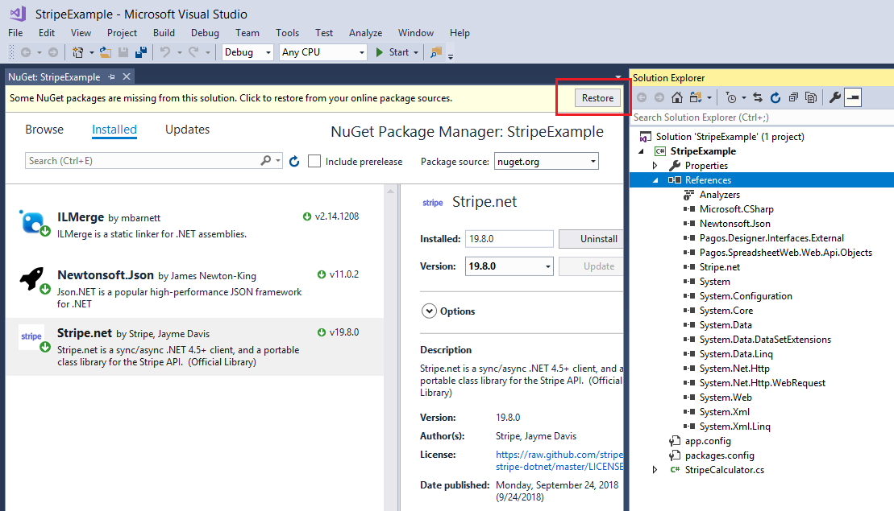
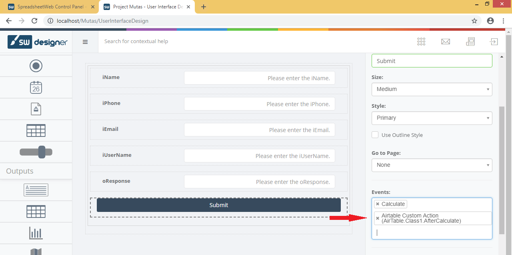
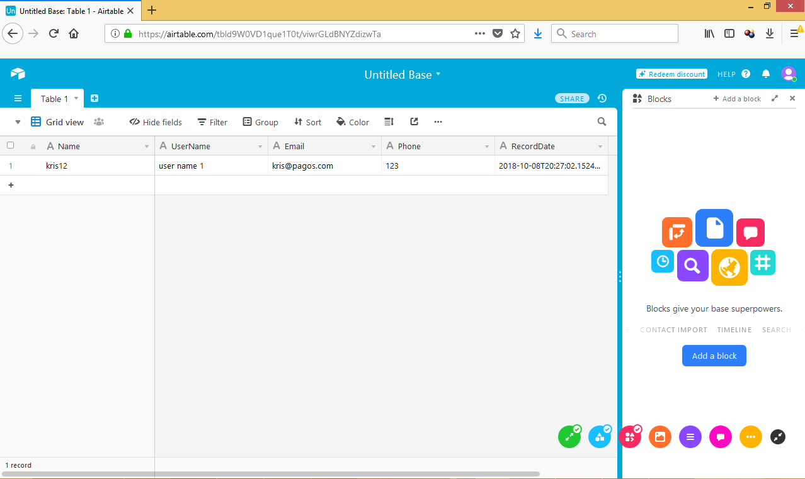

# SpreadsheetWeb Custom Actions Example - Airtable integration

SpreadsheetWeb is a platform for building and generating web applications and complex calculation engines from Excel models. The software is produced and distributed by Pagos Inc.

This repository contains sample code that aims to demonstrate how to inject custom code that can communicate with the [Airtable](https://airtable.com) API. The provided sample code submits a record to the Airtable data structure, but the same basic principles can be applied to any functions permitted by the target service.

> The sample can be used only with SpreadsheetWeb Server Packages - must have an active [server license](https://www.spreadsheetweb.com/server-pricing/).

> You will also need to have an active Airtable account in order to request access to their web service. 

## Download

If you have `git` command line installed on your computer, you can download the sample by running:

```bash
> git clone https://github.com/spreadsheetweb/samples-custom-actions-airtable
```

Alternatively, you can click the `Clone or Download` button on the GitHub page.

## How do Custom Actions work in the SpreadsheetWeb platform?

- Custom actions must be written as a .NET Framework Library. In our sample, we have generated a solution in C#, which can be viewed and modified with Microsoft Visual Studio or other compatible software.
- When creating a new library project you must add references to several prerequisite .NET libraries that will be provided to you. Alternatively, you can utilize the ones that are included in the sample or contact our support for more information on versions that are compatible with your server version.
- The copy included in the sample can be found under the _Pagos References_ folder. These are also added as references to the Visual Studio project.

    ```bash
    > Pagos.Designer.Interfaces.External.dll
    > Pagos.SpreadsheetWeb.SpreadsheetWebAPI.dll
    > Pagos.SpreadsheetWeb.Web.Api.Objects.dll
    ```

- In the imports section of your class file, make sure to include the following namespaces from the aforementioned libraries:

    ```C#
    using Pagos.Designer.Interfaces.External.CustomHooks;
    using Pagos.Designer.Interfaces.External.Messaging;
    using Pagos.SpreadsheetWeb.Web.Api.Objects.Calculation;
    ```

- The library needs to implement one or more interfaces exposed by the `Pagos.Designer.Interfaces.External.CustomHooks` namespace. More details regarding these interfaces can be found at the following help page: [Custom Actions in Designer](https://pagosinc.atlassian.net/wiki/spaces/SSWEB/pages/501186561/Custom+Actions+in+Designer).

    - `IBeforeCalculation`
    - `IAfterCalculation`
    - `IBeforeSave`
    - `IAfterSave`
    - `IBeforePrint`
    - `IAfterPrint`
    - `IBeforeEmail`
    - `IAfterEmail`

- Each of those interfaces expose specific methods, which you will need to implement. These can be seen in the sample.

## How to run the sample

1. Download the sample. This is a Visual Studio solution that includes a single C# class library.
2. Open the solution file in Visual Studio. Before proceeding, you should set your Airtable account credentials.

    ```C#
    namespace AirTable
    {
        ...
        
        public class Class1 : IAfterCalculation
        {
            private string applicationId = "your_airtable_application_id";
            private string tableName = "your_airtable_table_name";
            private string apiKey = "your_airtable_api_key";
            
            ...
        }
        ...
    }    
    ```

3. Resolve NuGet Packages. This solution utilizes extra dependencies which can be retrieved by using NuGet Package Manager. Simply right-click on _References_ in the _Solution Explorer_ in Visual Studio, then select _NuGet Packages_. In the Nuget Manager window, click on the **Restore** button, as shown in the following screenshot:

    
    
4. Compile the solution. The output of the compilation will be the **AirTableExample.dll** library, which can subsequently be uploaded as a custom action.
5. Create a Designer application on your SpreadsheetWeb server. For this, you will need an Excel file, which will act as the primary calculation. This can be found under the _Sample_ directory. You can also review [this link](https://pagosinc.atlassian.net/wiki/spaces/SSWEB/pages/35954/Custom+Applications) for more detailed on creating an application. **Important Note:** Remember to select  _Designer_ as the application type.
6. Once the application is created, navigate to _Custom Actions_, create a **New** custom action and submit the previously compiled **AirTableExample.dll**.
7. You will also need to create a user interface for the application. Navigate to the **User Interface Designer** and add controls to the default home page. Associate these controls with the named ranges from the Excel file. Alternatively you may use the **Generate** button, which will attempt to auto-generate a basic user interface based on the Excel calculation model's named range metadata. A video tutorial can be found at the following link: [User Interface in SpreadsheetWEB Designer](https://www.spreadsheetweb.com/project/user-interface-designer/). An example user interface can be seen below.

    
    
    > **Important Note:** In order for the custom action code to be executed, it will need to be attached to a button, as shown in the screenshot above. 
    
8. Preview the page or Publish the application.
9. Open the application and enter values in the corresponding textboxes.
10. Click the **Submit** button.

## What is the sample about?

Upon clicking the **Submit** button, the application should connect to the Airtable web service and generate a new entry on your Airtable application's table, which you can subsequently browse from the Airtable Dashboard.



> **Important Note:** Please remember that your table columns created at Airtable User Interface must match field names send in the request of your custom action. As you can see on the above screenshot we created 5 fields: **Name**, **UserName**, **Email**, **Phone**, **RecordDate**. Thus the relevant portion of the request object is defined the way to match those fields:
    
```c#
    public class FieldsObject
    {
        public string Name { get; set; }
        public string UserName { get; set; }
        public string Email { get; set; }
        public string Phone { get; set; }
        public DateTime RecordDate { get; set; }
    }
```


